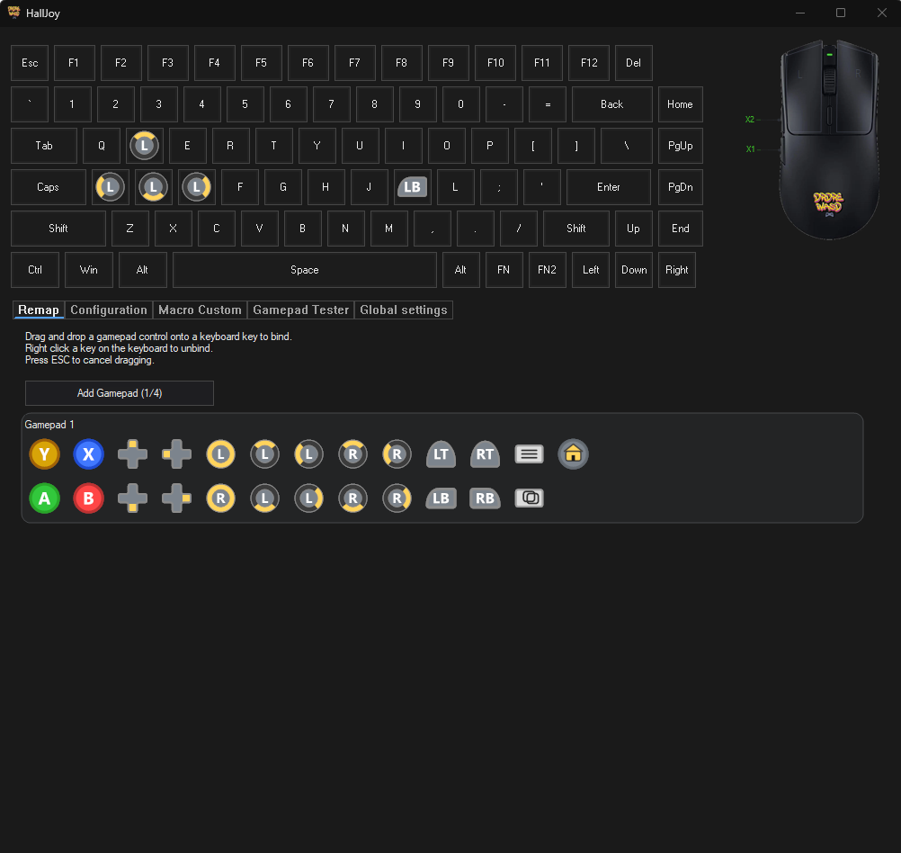
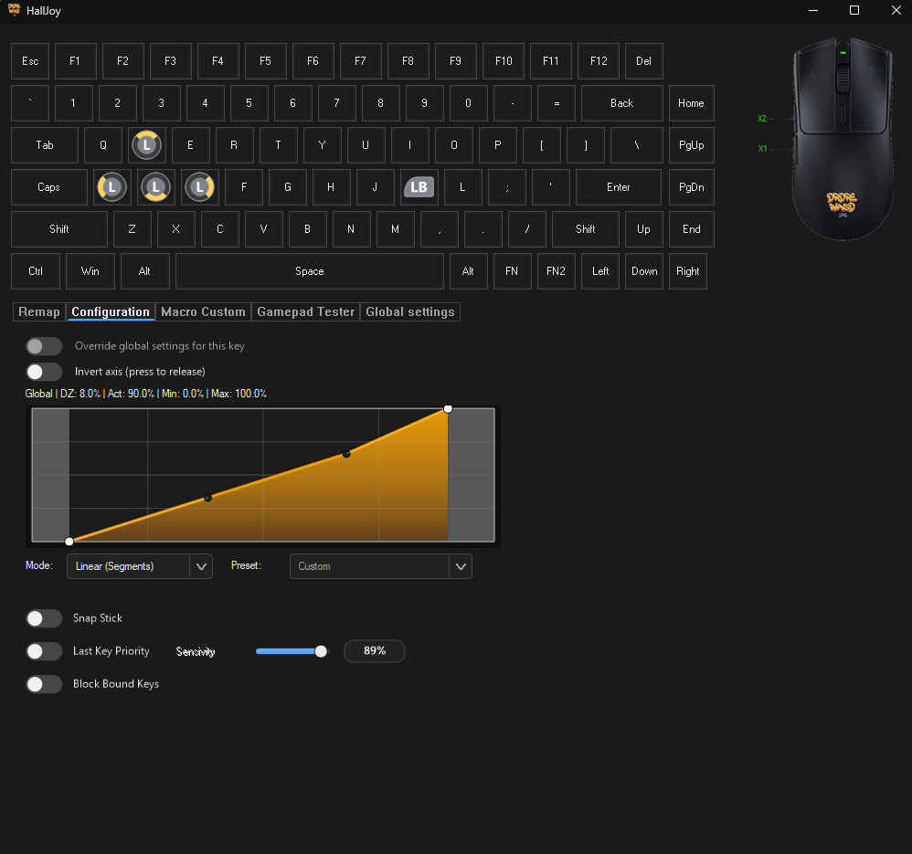
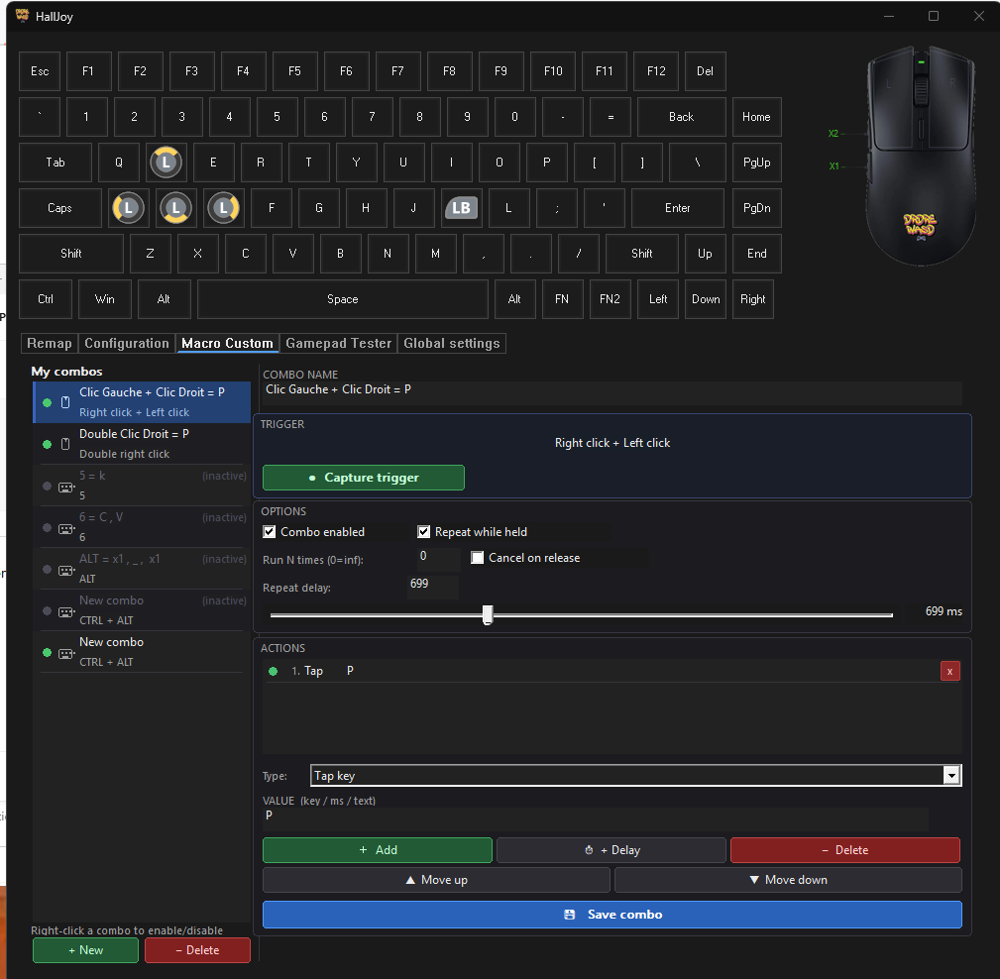
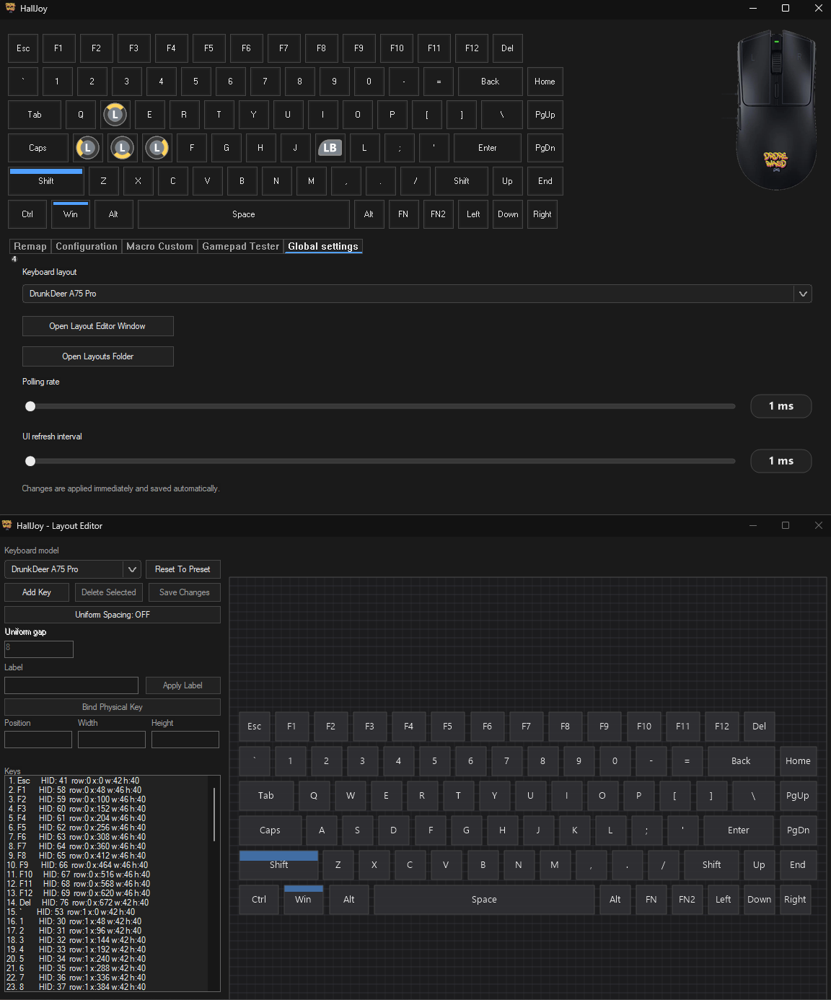

<p align="center">
  
</p>

<h1 align="center">DrDre_WASD</h1>

<p align="center">
  <b>Precision Input Automation for Hall-Effect Keyboards</b><br>
  Analog → Controller → Macro Engine — Built for serious gamers.
</p>

<p align="center">
  
  
  
  
</p>

---

## 🖼️ Interface Preview

<p align="center">
  
</p>

<p align="center">
  
</p>

<p align="center">
  
</p>

<p align="center">
  
</p>

---

## 🚀 What is DrDre_WASD?

> Based on HallJoy — heavily extended with a modern macro engine, advanced stability fixes, live mouse visualization, and competitive gaming tools.

DrDre_WASD turns a **Hall-effect analog keyboard** into:

- 🎮 Up to 4 virtual Xbox 360 controllers  
- 🧠 A fully programmable macro engine  
- 🖱️ A real-time mouse layout visualizer  
- ⚡ A low-latency competitive input system  

It reads analog values via the Wooting Analog SDK and outputs XInput controllers using ViGEmBus.

---

📺 **Original HallJoy presentation video**: [YouTube](https://youtu.be/MI_ZTS6UFhM?si=Cpn9DY95S9no9ncJ)

---


## ✨ Main Features

- Analog keyboard → virtual controller bridge with real-time updates
- Up to 4 simultaneous virtual controllers
- Full remapping UI for sticks, triggers, ABXY, bumpers, D-pad, Start/Back/Home
- Per-key advanced curve and dead zone tuning
- Last Key Priority and Stick Snap options
- Optional blocking of physical key output when bound to a controller input
- Keyboard layout editor (move/add/remove keys, labels, HID codes, sizes, positions)
- Custom layout presets with quick switching
- **Complete Custom Macro System** (see below)
- **Permanent live mouse layout** — floating top-view silhouette in the top-right corner, visible on all tabs, buttons light up in real time
- Settings saved alongside the executable

---

## ⌨️ Keyboard Support

DrDre_WASD uses:
- [Wooting Analog SDK](https://github.com/WootingKb/wooting-analog-sdk)
- [Universal Analog Plugin](https://github.com/AnalogSense/universal-analog-plugin)

This means it works with many HE keyboards supported by this stack — not just Wooting.

**Aula keyboards**: Experimental support is available but limited. Proper native support would require firmware-level changes or direct help from Aula firmware developers.

---

## 📦 DLL Installation — REQUIRED

The repository includes prebuilt `abiv0.dll` and `abiv1.dll` from the universal-analog-plugin, **with the deadlock fix applied** (stable 24h+ runtime).

⚠️ **You MUST place the DLL files in this exact folder:** 
- `C:\Program Files\WootingAnalogPlugins\`

Create the folder if it does not exist. Without this step, the analog keyboard will not be detected.

| File | Destination |
|------|-------------|
| `abiv0.dll` | `C:\Program Files\WootingAnalogPlugins\abiv0.dll` |
| `abiv1.dll` | `C:\Program Files\WootingAnalogPlugins\abiv1.dll` |

> 💡 If you prefer to compile the DLL yourself, the source is at [universal-analog-plugin](https://github.com/calamity-inc/universal-analog-plugin). Apply the `unload()` fix described in the Technical Details section below.

⚠️ **If you get a Get-WinEvent error mentioning:→** 
- `C:\Program Files\WootingAnalogPlugins\universal-analog-plugin\abiv1.dll`

> Also copy the **`.dll`** to: `C:\Program Files\WootingAnalogPlugins\universal-analog-plugin\abiv1.dll`
> **Or create both paths:** `C:\Program Files\WootingAnalogPlugins\abiv1.dll` **and** `C:\Program Files\WootingAnalogPlugins\universal-analog-plugin\abiv1.dll`

---

## 🚀 Getting Started

1. Copy `abiv0.dll` and `abiv1.dll` to `C:\Program Files\WootingAnalogPlugins\`
2. Install [ViGEmBus](https://github.com/ViGEm/ViGEmBus)
3. Install [Wooting Analog SDK](https://github.com/WootingKb/wooting-analog-sdk)
4. Launch `DrDre_WASD.exe`
5. Select or create a keyboard layout
6. Map keys to controller inputs in the **Remap** tab
7. Adjust curves and behaviors in **Configuration**
8. Create and manage macros in the **Custom Macro** tab

> If dependencies are missing, the application may offer to download/install them automatically.


---

## 🎬 Custom Macro Tab — Complete Guide

The **Custom Macro** tab lets you bind complex action sequences to any **mouse button or keyboard trigger combination**, fired automatically during gameplay — no dedicated macro keys needed.

### Creating a Macro

1. Click **`+ New`** to create a new macro entry
2. Give it a name in the **Combo Name** field
3. Click **`● Capture trigger`** — press your desired key or mouse button combination (1 or 2 inputs)
4. Build your action sequence in the **Actions** card
5. Click **`💾 Save combo`** to confirm

### Enable / Disable a Macro

- **Check the box** `Combo enabled` in the Options card, then Save — or
- **Right-click** the macro in the list for an instant toggle

The left list shows a **green dot** (active) or **grey dot** (inactive) next to each macro for a quick overview.


# 🔥 The Custom Macro Engine (The Real Power)

This is where DrDre_WASD becomes different.

You can bind **complex action sequences** to:

- Mouse button combinations  
- Keyboard triggers  
- Double-clicks  
- Scroll wheel combos  
- Held-button combos (e.g. Right-click held + Left click)  
- Simultaneous multi-button triggers  

No dedicated macro keys required.

#### 🖱️ Mouse Click Actions — Live Capture

When **Mouse click** is selected as the action type, a **🖱 capture button** appears to the right of the value field. Click it, then press any mouse button — the button name fills in automatically.

Supported buttons: `left`, `right`, `middle`, `X1 (thumb)`, `X2 (thumb2)`

You can also type the button name directly in the value field without using the capture button.


### Options

| Option | Description |
|--------|-------------|
| Combo enabled | Enable or disable the macro without deleting it |
| Repeat while held | Keeps firing the sequence while the trigger is held |
| Repeat delay | Milliseconds between each repetition |

### Interface Notes

- The right column **scrolls** with the mouse wheel when the window is too small vertically — a thin accent-colored scrollbar appears on the right edge and can be dragged
- The action type **dropdown opens fully** on click, showing all 6 action types at once

---

## 🎮 Example Gaming Macros

### 🎯 FPS (Valorant, CS2, Apex…)

| Trigger | Action | Result |
|----------|--------|--------|
| Right-click held + Left click | Tap `P` | Ping enemy while staying in ADS |
| Middle + Left click | Tap `E` | Interact while shooting |
| Scroll up + right-click held | Tap `F2` | Instant wall switch while aiming |
| Key `6` | Tap `E` + Wait 100ms + Tap `E` | C4 plant / detonate pattern |

---

### ⚔️ MMO / ARPG

| Trigger | Action | Result |
|----------|--------|--------|
| Right-click held + Left click | `1 → wait 100ms → 2 → wait 100ms → 3` | Skill rotation combo |
| Scroll up + right-click held | Tap `4 → wait 50ms → 5` | Burst combo |
| Double right-click | Tap `F → wait 500ms → Tap F` | Charge / detonate |

---

### 💬 Text Macros — Type Lines / Code at Speed

The **Type text** action turns any macro into a **text expander**. Fire a full sentence, code snippet, or command with a single trigger.

| Trigger | Action Sequence | Result |
|---------|----------------|--------|
| Keyboard shortcut | Type text `gg well played, thanks for the game!` | GG message in one keystroke |
| Keyboard shortcut | Type text `sudo apt update && sudo apt upgrade -y` | Full terminal command instantly |
| Keyboard shortcut | Type text `console.log('DEBUG:', JSON.stringify(data, null, 2));` | Code snippet in any editor |
| Keyboard shortcut | Type text + Wait 200ms + Tap `Enter` | Auto-submit form / command |
| Repeat while held | Type text `#` | Fill a line with characters for formatting |

> **Tip**: combine **Type text** with **Wait** and **Tap Enter** to automatically send chat messages, commands, or multi-line snippets in any application.

---

## 🖥️ Interface Tabs

| Tab | Description |
|-----|-------------|
| **Remap** | Drag and drop controller buttons onto keyboard keys, up to 4 virtual controllers |
| **Configuration** | Per-key analog curve editor (Linear, Segments, Custom), dead zone, actuation point — scrollable |
| **Custom Macro** | Free-trigger macro editor with full action sequencer, enable/disable toggle, right-click menu, mouse click actions, scrollable layout |
| **Gamepad Tester** | Real-time monitor of all axes and button states of virtual controllers |
| **Global Settings** | Keyboard layout, polling rate (1ms default), UI refresh interval |

---


## 🖱️ Live Mouse Layout

A floating top-view mouse silhouette:

- 60 FPS refresh
- L / R / M / X1 / X2 highlight in real-time
- Always visible in top-right
- No placeholder icons — custom drawn shape

Perfect for verifying macro triggers visually.

---


## 🛡️ Macro Safety System

DrDre_WASD includes a built-in macro safety system designed to prevent runaway macros, accidental input injection into the wrong application, and infinite loops — without any impact on normal usage.

---

### Emergency Stop

**Shortcut: `Ctrl + Alt + Backspace`**

Immediately halts all macro activity:
- Clears the entire execution queue
- Cancels the currently running macro
- Logs the reason to the debug output

You can also call it programmatically:
```cpp
FreeComboSystem::EmergencyStop(L"user-hotkey");
```

> **Note:** The worker thread stops cleanly between actions — it does not kill mid-keystroke, which avoids leaving physical keys stuck in a pressed state.

---

### Watchdog

Three independent limits run simultaneously in the background. All violations are logged to the debug output (`OutputDebugStringW` — visible in Visual Studio Output or [DebugView](https://learn.microsoft.com/en-us/sysinternals/downloads/debugview)).

#### 1. Runtime Timeout — 10 seconds
A macro that runs for more than **10 seconds continuously** is stopped.

```
[WATCHDOG] Macro stopped — reason: timeout — macro: RapidFire — runtime: 12.4s
```

- The timer resets between each run, so a macro set to "Run N times" gets 10s per run
- `Delay` actions respect the timeout — a 15s delay will be cut at 10s

#### 2. Max Actions — 500 per run
A run that executes more than **500 individual actions** is stopped.

```
[WATCHDOG] Macro stopped — reason: max actions (500) — macro: SpamMacro
```

- Every `PressKey`, `ReleaseKey`, `TapKey`, `MouseClick`, `Delay`, and `TypeText` counts as one action
- For `TypeText`, **each character** counts individually — a 600-character string triggers the limit

#### 3. Trigger Rate Limit — 50 triggers/second
A `repeatWhileHeld` macro that fires more than **50 times per second** triggers a **hard stop** — the queue is cleared and the current run is cancelled.

```
[WATCHDOG] Hard stop — reason: rate limit (>50/s) — macro: BrokenMacro
```

- This is stricter than the other two limits because a runaway trigger rate would immediately refill the queue
- Typically caused by `repeatDelayMs = 0` combined with a very fast loop

---

### WatchMan

Prevents macros from sending keystrokes or mouse input into applications that are not explicitly whitelisted.

**Accessible from the Macro Custom tab → INJECTION GUARD panel**

| Mode | Behavior |
|------|----------|
| `OFF` | Inject everywhere (default) |
| `WHITELIST` | Only inject if the foreground app is in the allowed list |

**How it works:**
Before every `SendInput` call, the engine checks the foreground window's process name against your whitelist using `QueryFullProcessImageNameW`. The comparison is case-insensitive (`cs2.exe` = `CS2.EXE`).

**Protected action types:** `PressKey`, `ReleaseKey`, `TapKey`, `MouseClick`, `TypeText`

**Not protected:** `Delay` — pauses always execute regardless of the foreground app.

**Adding apps to the whitelist:**
1. Open the **Macro Custom** tab
2. In the **INJECTION GUARD** panel at the bottom left, select `WHITELIST - Allowed apps only`
3. Type the executable name (e.g. `cs2.exe`) and click `+`
4. Save any combo — the whitelist is persisted in the `.fcombos` file

**Persistence:**
The whitelist is saved in the `DRDRE_FREECOMBOS_V5` format. Files from earlier versions (V1–V4) load normally with the whitelist empty and mode set to OFF.

```
WL_MODE 1
WL_COUNT 2
WL_ENTRY cs2.exe
WL_ENTRY valorant.exe
```

> **Known limitation:** If the foreground process is elevated (e.g. running as Administrator) and DrDre_WASD is not, `OpenProcess()` may fail and injection will be blocked for that app even if it is whitelisted.

---

### Limits & Known Gaps

| Issue | Status |
|-------|--------|
| Keys held down at watchdog stop | Not auto-released — use `Ctrl+Alt+Backspace` to fully reset |
| Whitelist not reloaded into the UI list on startup | Visual only — the engine loads and applies the whitelist correctly |
| Watchdog limits are compile-time constants | Cannot be changed from the UI — edit `kWD_MaxRuntimeMs`, `kWD_MaxActions`, `kWD_MaxTrigsPerSec` in `free_combo_system.cpp` |
| Debug logs only visible in DebugView / VS Output | No in-app log panel yet |

---

## 🏗️ DrDre_WASD Input Architecture

DrDre_WASD processes input through three distinct pipelines:

- **Analog → Controller → Game**
- **Analog → Macro → Controller → Game**
- **Analog → Macro → Direct Game (Keyboard Injection)**

---

### 🔄 Input Flow Overview

```text
                ┌─────────────────────────┐
                │   Hall-Effect Keyboard  │
                └────────────┬────────────┘
                             ↓
                     Wooting SDK Layer
                             ↓
                 Universal Analog Plugin
                             ↓
                    DrDre_WASD Core
                             ↓
        ┌────────────────────┼────────────────────┐
        ↓                    ↓                    ↓
  Analog Mapping        Macro Engine        Input Injection
 (Controller Map)   (Analog & Digital)   (Controller / KB)
        ↓                    ↓                    ↓
      ViGEm             Virtual Input         Windows Input
        ↓                    ↓                    ↓
  Game Application     Game Application       Game Application

```


---


## 🔧 Building

1. Open `HallJoy.sln` in Visual Studio 2022
2. Select `Release | x64`
3. Build — the PreBuildEvent automatically copies `wooting_analog_sdk.dll` and `wooting_analog_wrapper.dll` from `runtime\` to the output directory

> ⚠️ **Note**: `wooting_analog_sdk.dll` and `wooting_analog_wrapper.dll` are included in the `runtime\` folder of this repository and bundled in the source zip. If downloading v1.0, get them from the [runtime folder](https://github.com/paysdelest/DrDre_WASD/tree/main/runtime) or from [Wooting Analog SDK releases](https://github.com/WootingKb/wooting-analog-sdk/releases) and place them in `runtime\` before building.

> ⚠️ **Note for developers**: `free_combo_system.cpp` and `free_combo_ui.cpp` must be explicitly added to the Visual Studio project (right-click project → **Add → Existing Item**). They are not referenced in the `.vcxproj` by default.

---

## 🔩 Technical Details — abiv1.dll Deadlock Fix

A critical bug was identified and fixed in the **universal-analog-plugin** (`abiv1.dll`). After ~4 hours of runtime, the plugin crashed with `0xc0000005 INVALID_POINTER_READ` inside `unload()`.

**Root cause**: `awaitCompletion()` was called while `devices_mtx` was still held. The internal device thread then called `discover_devices()`, which also tries to acquire `devices_mtx` — deadlock. Windows force-terminated the thread, corrupting internal pointers.

**Fix**: split `unload()` into two passes — `cancelReceiveReport()` with the lock held, then `awaitCompletion()` after releasing the lock. The fixed DLL runs stably for 12h+.

A fix has been submitted upstream to [universal-analog-plugin](https://github.com/calamity-inc/universal-analog-plugin).

---

## 🛠️ Troubleshooting

- **All analog values at 0** — check your keyboard's firmware mode. Some keyboards disable analog SDK output when **Turbo mode** is enabled. Disable it and restart.
- **Analog stops working after a plugin update** — reinstall the DLL files from this repository and keep only one plugin variant in `C:\Program Files\WootingAnalogPlugins\`
- **Macro does not trigger** — check whether the emergency stop was activated (`Ctrl+Shift+Alt+F12`), or verify the macro is enabled (green dot in the list)
- **Macro enabled but not firing** — make sure the trigger combination is not captured by another application or system shortcut
- **Controls do not resize correctly** — make sure you are using v2.0 or later; previous builds had a WM_SIZE layout bug when the tab was hidden


### Enable Logging (for debugging)

By default, logging is disabled to preserve performance. To enable it, open `settings.ini` and set:

```ini
[Main]
Logging=1
```

A `HallJoy_log.txt` file will be created alongside the executable. Set `Logging=0` (or remove the line) when done.

### Wooting SDK Rollback (if needed)

If a newer Wooting SDK version causes unstable input or flickering:

```powershell
# List available tags
powershell -ExecutionPolicy Bypass -File .\tools\rollback-wooting-sdk.ps1 -ListOnly

# Install a specific tag (example v0.8.0)
powershell -ExecutionPolicy Bypass -File .\tools\rollback-wooting-sdk.ps1 -Tag v0.8.0
```

Then rebuild in VS (`Release | x64`) and relaunch. The script updates DLLs in `runtime\`, `x64\Release\`, and `x64\Debug\`, and creates automatic backups under `runtime\backup\`.

---

## 📁 Configuration Files

Stored alongside the executable:

| File / Folder | Contents |
|---------------|----------|
| `settings.ini` | Global settings |
| `bindings.ini` | Key-to-controller bindings |
| `Layouts/` | Keyboard layout presets (1 file = 1 preset) |
| `CurvePresets/` | Curve preset files |
| `free_combos.dat` | Custom Macro configurations |

---

## 📋 Requirements

- Windows 10/11 (x64)
- [ViGEmBus](https://github.com/ViGEm/ViGEmBus)
- [Wooting Analog SDK](https://github.com/WootingKb/wooting-analog-sdk)
- `abiv0.dll` + `abiv1.dll` in `C:\Program Files\WootingAnalogPlugins\`

---

## 🙏 Credits

- **[PashOK7](https://github.com/PashOK7/HallJoy)** — original HallJoy project
- **[calamity-inc](https://github.com/calamity-inc/universal-analog-plugin)** — universal-analog-plugin (Soup / abiv1.dll)
- **[ViGEmClient](https://github.com/nefarius/ViGEmClient)** — virtual controller emulation
- **[Wooting](https://github.com/WootingKb/wooting-analog-sdk)** — Analog SDK

---

## 📄 License

MIT — free to use, modify and redistribute. See [LICENSE](LICENSE).

---

*DrDre_WASD v2.3 — Precision Input Automation for Hall-Effect Keyboards*

---

<p align="center">
  ⭐ If this project helps you, consider starring the repository.
</p>
